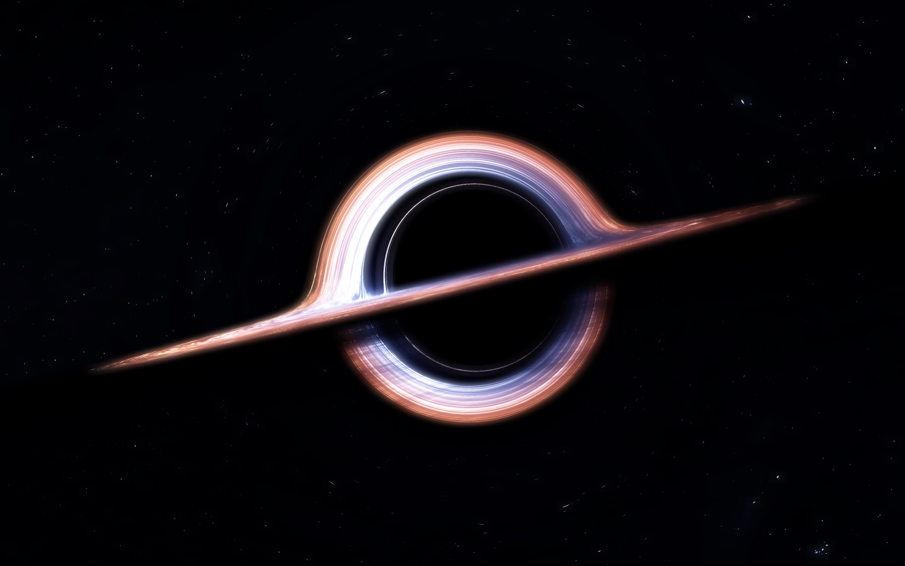

# Black-Hole-Image

This repository is to put the simlation image/result of Kerr / Schwarzschild Black Hole, using the `WebGL` or `Metal`.  All the simulation is using the natural unit $(G=c=1)$, and the mass of black hole is $M = 1$. For Schwarzschild metric, we using

$$
d s^2 = \left(1 - \frac{r_s}{r}\right)d t^2 + \left(1 - \frac{r_s}{r}\right)^{-1}d r^2 + d\theta^2 + \sin^2\theta\,d\phi^2\,,
$$

where $r_s$ is the Schwarzschild radius given by $r_s = 2GM/c^2$ and here using spherical coordinate $(t,r,\theta,\phi)$. On the other hand, the Kerr metric is given by

$$
g_{\mu\nu} = \eta_{\mu\nu} + \left(\frac{2GMr^3}{r^4 + az^4}\right)k_{\mu}\,k_{\nu}\,,
$$

where $k_{\mu}$ is a unit vector given by $\displaystyle \vec{k} = \left(\frac {rx+ay}{r^2+a^2},\frac{ry-ax}{r^2+a^2},\frac{z}{r}\right)$, and here using Kerr–Schild "Cartesian" coordinates, which satisfied 

$$
x^2 + y^2 + z^2 = r^2 + a^2\left(1 - \frac{z^2}{r^2}\right)\,,
$$

and $a$ is the rotational parameter related to the angular momentum $J$, which is given by $a = J/Mc$. To see more introduction about Kerr metric, see arXiv paper: [2008, Matt Visser, *The Kerr spacetime: A brief introduction*](https://arxiv.org/abs/0706.0622).

## Example

**Click image to see video on YouTube**

<a href="https://youtu.be/bswZj-eAFSk?si=TCcypM0hRnJySV0z"></a>

- Download video: [`video/kerr-4536x2835-1000fs.mp4`](https://github.com/Jeffreymaomao/Black-Hole-Image/raw/refs/heads/main/video/kerr-4536x2835-1000fs.mp4)
- Download TIFF image (Kerr Black hole):
    - [`kerr-4536x2835-1000fs/frame_0.tiff`](https://github.com/Jeffreymaomao/Black-Hole-Image/raw/refs/heads/main/Kerr-4536x2835-1000fs/frame_0.tiff)
    - [`kerr-1428x844-100fs/frame_0.tiff`](https://github.com/Jeffreymaomao/Black-Hole-Image/raw/refs/heads/main/kerr-1428x844-100fs/frame_0.tiff)

## Note of ffmpeg

- `frame_n.tiff` $\to$ `a.mp4`

    ```bash
    $ ffmpeg -framerate 100 -i frame_%d.tiff -c:v libx264 -crf 18 -preset slow -tune stillimage -pix_fmt yuv420p output.mp4
    ```

    ```bash
    $ ffmpeg -framerate 100 -i frame_%d.tiff -vf "scale=4536:2836" -c:v libx264 -crf 18 -preset slow -pix_fmt yuv420p output.mp4
    ```

